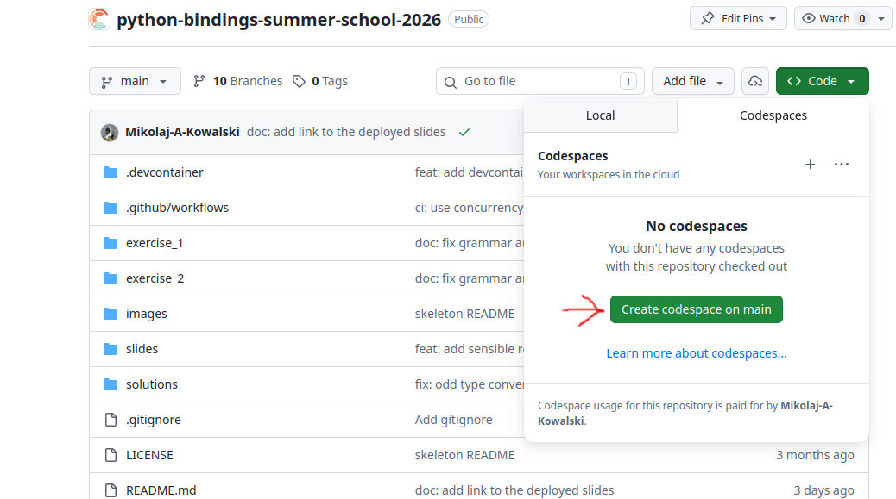
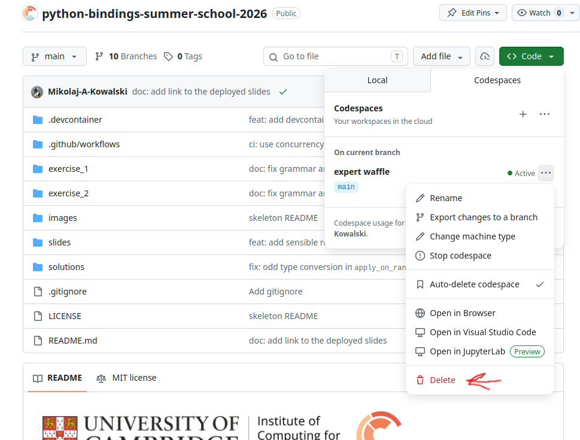

## Scope of the course

:::{.fragment}
What this course will **not** teach you:

::::{.incremental}
- How to properly bind compiled (C++/Fortran) code to Python
- If you are quick enough you can still make it to Testing (part 1)!
- The topic is too broad to be covered in 1.5h session

::::
:::

:::{.fragment}
What this course **will** teach you:

::::{.incremental}
- Give a 'taste' of how binding compile code looks like
- Showcase some things you can achieve with it
- Give some examples that can be good starting point for further study
:::: 
:::

## Preliminaries {.smaller}

::::{.columns}

:::{.column width="80%"}

This deck of slides is available online:  
[https://cambridge-iccs.github.io/python-bindings-summer-school-2026/](https://cambridge-iccs.github.io/python-bindings-summer-school-2026/)

Github repository:  
[https://github.com/Cambridge-ICCS/python-bindings-summer-school-2026](https://github.com/Cambridge-ICCS/python-bindings-summer-school-2026)

To run the exercises we will use a GitHub Codespace. You can access it by clicking the link below:  
[https://codespaces.new/Cambridge-ICCS/python-bindings-summer-school-2026](https://codespaces.new/Cambridge-ICCS/python-bindings-summer-school-2026)

If you close a tab, the link above will create a new Codespace. To resume latest work, you can use the link below:  
[https://codespaces.new/Cambridge-ICCS/python-bindings-summer-school-2026?quickstart=1](https://codespaces.new/Cambridge-ICCS/python-bindings-summer-school-2026?quickstart=1)

::: {.callout-warning}
GitHub may include a warning saying: 
["Codespace usage for this repository is paid for by \<you\>"]{.mark}  
Don't worry, you will not be charged. There is a free quota each month.
:::

:::

:::{.column  width="20%"}
**Slides link**
{width=100%}
:::

::::

## Preliminaries: Codespace {.smaller}

In the repository:
[https://github.com/Cambridge-ICCS/python-bindings-summer-school-2026](https://github.com/Cambridge-ICCS/python-bindings-summer-school-2026)

::::{.columns}

:::{.column width="50%"}

**List or open a codespace**:  
{width=100%}

::: {.callout-note}
# Task

Open a codespace now.
:::

:::

:::{.column width="50%"}

**Don't forget to delete when you are done**:  
{width=100%}

:::

::::

## Preliminaries: Running locally

System requirements:

 - Linux
 - Python (3.11+) `python3 --version`
 - CMake (3.16+) `cmake --version`
 - C, C++, Fortran compilers e.g. `gcc --version`
 - Python development headers (e.g. `python3-dev` on Ubuntu)

:::{.callout-caution}
# Running locally is the danger zone 🛦🛦🛦

Please prefer the codespace for the course. Try on you machine during miniproject or at home.

:::

## Python bindings: what do we mean?

:::: {.columns}

::: {.column .fragment width="50%"}
### Python

- **CPython**: the reference implementation of Python
    - It is what you have on your machine!
- Other interpreters (e.g PyPy) have different interfaces  and tools
    - They are out of scope
:::

::: {.column .fragment width="50%"}
### Bindings
- A way to **call code** written in C, C++ or Fortran compiled into a **library**
- For example: PyTorch, Jax, NumPy, ... and Matplotlib. 

::::{.callout}
Bindings make Python a 'glue' between different optimised high-performance libraries.
::::
:::
::::

## Swimming analogy

I will be stealing an analogy (might be a spoiler for the dinner! ;-) )

::::{.callout}
"Programming is like swimming. You can only learn by doing it."
::::

:::{.fragment .r-stretch style="text-align: center;"}
{width=40%}

### Let us jump into the water!
:::
